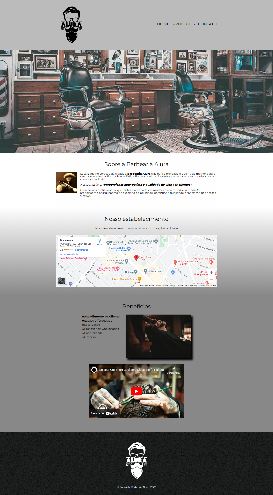
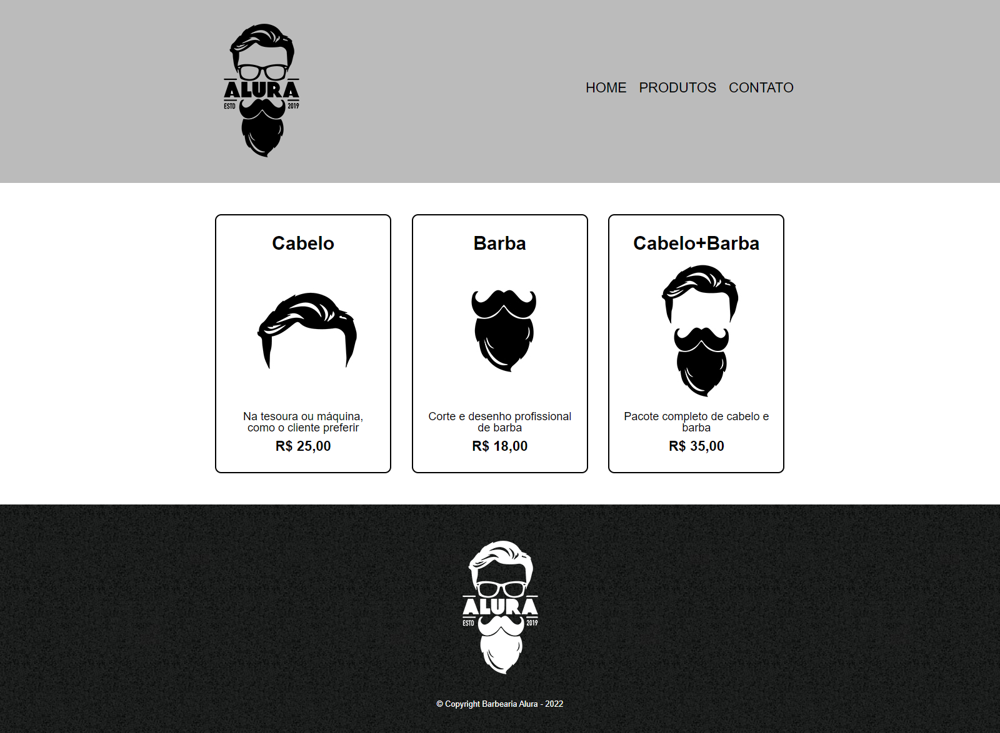
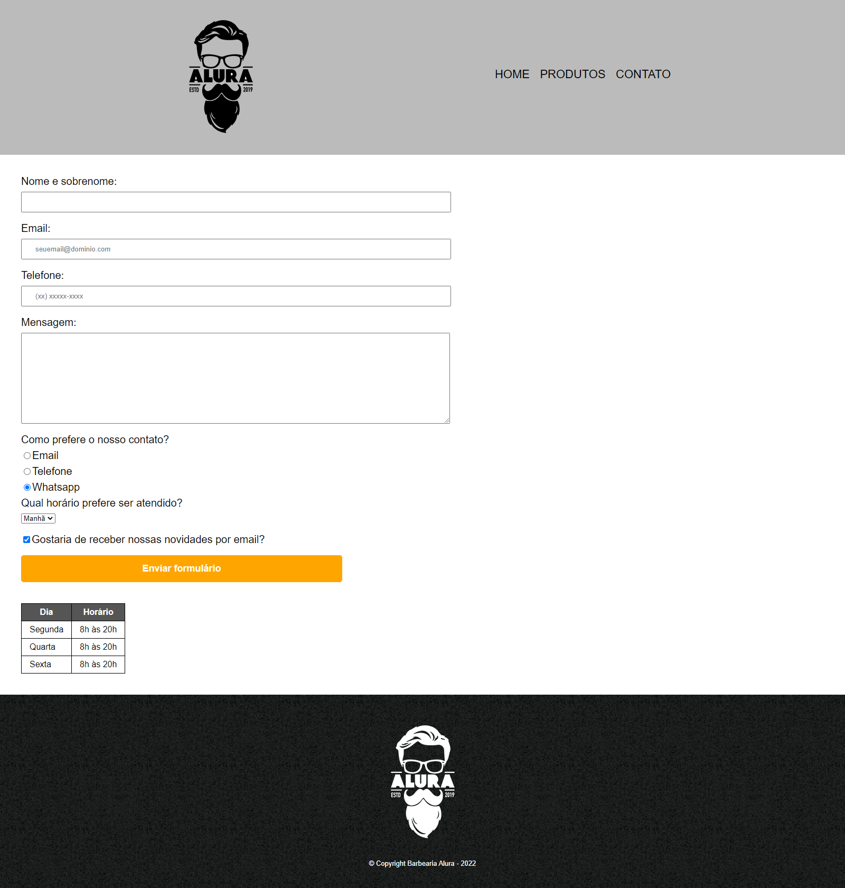

<h1 align="center"> Barbearia Alura </h1>

Barbearia Alura é um Layout simples de estudo feito no curso da Alura, responsivo - 3 paginas diferentes, pagina principal, produtos/serviços e contatos 

<h2>Temas abordados</h2>

- [Tags HTML 5](https://www.w3schools.com/TAGS/ref_eventattributes.asp) 
- [Semântica HTML](https://www.w3schools.com/html/html5_semantic_elements.asp)
- [Sintaxe CSS](https://www.w3schools.com/css/css_syntax.asp)
- [Seletores CSS](https://www.w3schools.com/css/css_selectors.asp)
- [Position](https://www.w3schools.com/cssref/pr_class_position.php)
- [Responsividade](https://www.w3schools.com/css/css_rwd_intro.asp)
- [Formularios](https://www.w3schools.com/html/html_forms.asp)

<h2>O Projeto</h2>

